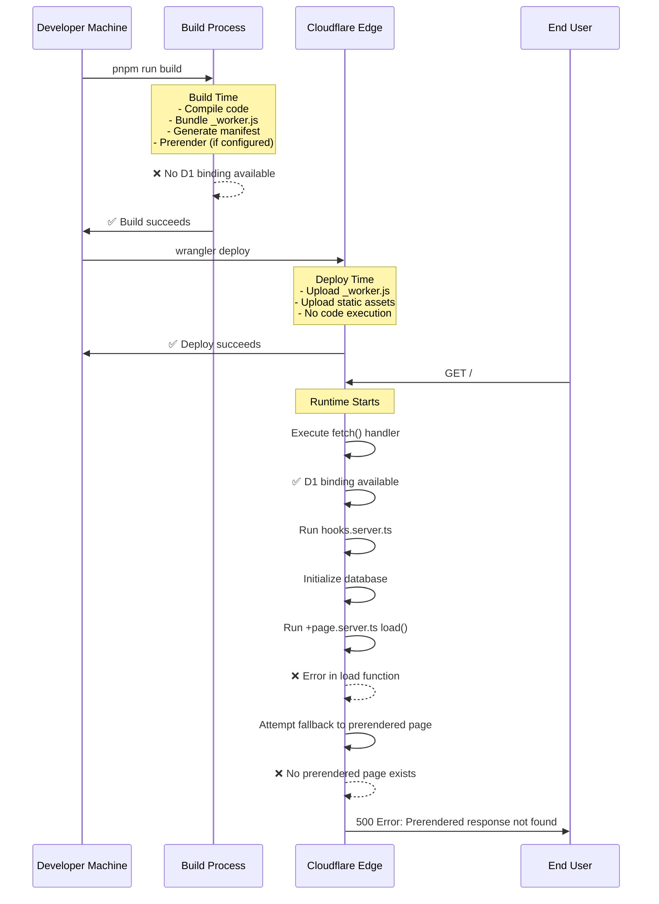
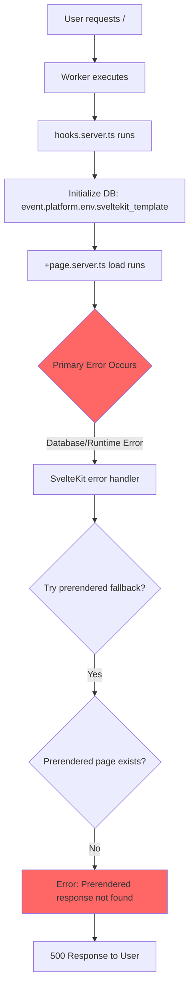
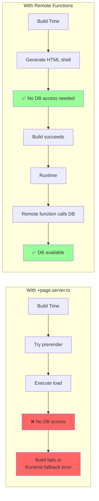
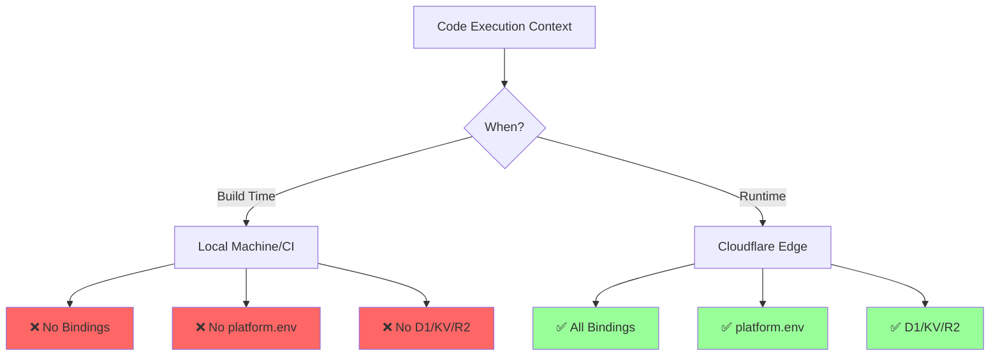

# SvelteKit Cloudflare Deployment Error Analysis

## Error Description

When deploying a SvelteKit application to Cloudflare Pages/Workers with D1 database integration, the following error occurred in Cloudflare logs when accessing the root route (`/`):

```
[500] GET /
Error: Prerendered response not found
    at _worker.js:1926:25
    at async _worker.js:1935:42
```

(output of `pnpm wrangler tail`)

### Key Facts

- **Error Type**: Runtime error (not build error)
- **HTTP Status**: 500 Internal Server Error
- **Location**: Cloudflare edge servers (during request processing)
- **Root Cause**: SvelteKit attempting to fallback to a prerendered page that doesn't exist
- **Primary Issue**: Server load function failing at runtime, triggering fallback mechanism

---

## Glossary

### Build Time

The phase when running `pnpm run build` locally (or in CI) where:

- Vite/SvelteKit compiles and bundles code
- Static assets are generated
- Prerendering occurs (if configured)
- **No Cloudflare bindings available** (D1, KV, R2, etc.)

### Runtime

The execution context on Cloudflare's edge servers when:

- A real HTTP request is received
- Worker's `fetch()` handler is invoked
- **Cloudflare bindings ARE available** (D1, KV, R2, etc.)
- Code executes with access to platform resources

### Prerendering

SvelteKit's process of generating static HTML files at **build time** by:

- Executing `load` functions without real HTTP requests
- Saving the resulting HTML to disk
- Serving these static files at runtime for faster performance

### Remote Functions

SvelteKit's experimental feature (enabled via `experimental.remoteFunctions`) that:

- Creates automatic API endpoints from server functions
- Separates static HTML generation from dynamic data fetching
- Allows pages to be prerendered as shells while data loads dynamically

### Server Load Function

A `load` function exported from `+page.server.ts` or `+layout.server.ts` that:

- Runs on the server only (never in the browser)
- Executes during SSR and optionally during prerendering
- Has access to `platform`, `locals`, and other server-only context

### SSR (Server-Side Rendering)

The process of generating HTML on the server for each request, as opposed to static generation at build time

---

## Timeline Analysis



---

## Root Cause Analysis

### What Actually Happened

1. **Build succeeded** without prerendering:
   - No `export const prerender = true` configured
   - Manifest shows: `prerendered_routes: new Set([])` (empty)
   - All routes configured for SSR (server-side rendering)

2. **Deploy succeeded**:
   - `_worker.js` and assets uploaded to Cloudflare
   - No code execution during deployment

3. **Runtime error occurred**:
   - User visited the site
   - Worker executed on Cloudflare's edge
   - `+page.server.ts` load function ran
   - Attempted to access `locals.db` (D1 database)
   - Database access or initialization failed
   - **SvelteKit's error handling triggered**
   - Attempted to fall back to prerendered page
   - No prerendered page existed → "Prerendered response not found"

### Why the Error is Misleading

The "Prerendered response not found" error is a **secondary error**. The sequence was:



---

## The Solution: Remote Functions

### Problem with `+page.server.ts`

When a `+page.server.ts` with a `load` function exists:

```typescript
// ❌ Problematic approach
export const load = async ({ locals }) => {
	const users = await locals.db.select().from(user);
	return { users };
};
```

**Issues:**

- SvelteKit may attempt to prerender this route
- During prerendering (build time), `locals.db` doesn't exist
- At runtime, if this fails, SvelteKit tries to fall back to prerendered version
- No prerendered version exists → error

### Solution: Remote Functions

```typescript
// ✅ Better approach: Remote function
// File: users.remote.ts
import { query } from '$app/server';
import { getRequestEvent } from '$app/server';
import { user } from '$lib/server/db/schema';

export const getUsers = query(async () => {
	const { locals } = getRequestEvent();
	const users = await locals.db.select().from(user);
	return users;
});
```

```svelte
<!-- File: +page.svelte -->
<script>
	import { getUsers } from './users.remote';
</script>

{#await getUsers()}
	<p>Loading...</p>
{:then users}
	<!-- Display users -->
{/await}
```

### Why Remote Functions Work



**Benefits:**

1. **Separation of concerns**: Static shell generation separate from dynamic data
2. **No prerendering conflicts**: Page can be prerendered without database access
3. **SSR-only execution**: Remote functions only run at runtime when resources are available
4. **Graceful degradation**: Errors in remote functions fail gracefully in Svelte components

---

## Configuration Analysis

### Project Configuration

**svelte.config.js:**

```javascript
import adapter from '@sveltejs/adapter-cloudflare';

export default {
	kit: {
		adapter: adapter(),
		experimental: {
			remoteFunctions: true // ✅ Enables remote functions
		}
	}
};
```

**wrangler.jsonc:**

```jsonc
{
	"name": "sveltekit-template",
	"main": ".svelte-kit/cloudflare/_worker.js",
	"compatibility_date": "2025-10-01",
	"compatibility_flags": ["nodejs_als", "nodejs_compat"],
	"assets": {
		"binding": "ASSETS",
		"directory": ".svelte-kit/cloudflare"
	},
	"d1_databases": [
		{
			"binding": "sveltekit_template",
			"database_name": "sveltekit-template",
			"database_id": "47cb1839-5239-44ad-a483-29d05e0d602b"
		}
	]
}
```

### Build Output Analysis

**Manifest findings:**

- `prerendered_routes: new Set([])` — No routes prerendered
- All routes configured for SSR
- Remote functions properly registered in manifest

---

## Alternative Solutions

If you prefer to keep using `+page.server.ts` instead of remote functions:

### Option 1: Disable Prerendering Explicitly

```typescript
// File: +page.server.ts
export const prerender = false; // ✅ Explicitly disable prerendering

export const load = async ({ locals }) => {
	const users = await locals.db.select().from(user);
	return { users };
};
```

### Option 2: Disable Prerendering in Layout

```typescript
// File: +layout.server.ts
export const prerender = false; // ✅ Disable for all routes

export const load = async ({ locals }) => {
	return {
		user: locals.user ?? null
	};
};
```

### Option 3: Use 'auto' Prerendering

```typescript
// File: +page.server.ts
export const prerender = 'auto'; // ✅ Skip prerendering if dependencies unavailable

export const load = async ({ locals }) => {
	const users = await locals.db.select().from(user);
	return { users };
};
```

---

## Best Practices for SvelteKit + Cloudflare

### 1. Understand Resource Availability



### 2. Choose the Right Pattern

| Use Case                      | Pattern                                                        | Prerender     |
| ----------------------------- | -------------------------------------------------------------- | ------------- |
| Static content only           | `+page.svelte` with no server load                             | ✅ Yes        |
| Data from D1/KV at build time | ❌ Not possible                                                | ❌ No         |
| Data from D1/KV at runtime    | Remote functions or `+page.server.ts` with `prerender = false` | ❌ No         |
| Mixed static + dynamic        | Remote functions (static shell + dynamic data)                 | ✅ Shell only |

### 3. Configure Prerendering Correctly

**For database-driven apps (recommended):**

```typescript
// +layout.server.ts
export const prerender = false; // Disable globally
```

**For hybrid apps:**

```typescript
// +layout.ts
export const prerender = false; // Default: no prerendering

// +page.ts (specific static pages)
export const prerender = true; // Override for specific pages
```

### 4. Use Remote Functions When Possible

Remote functions are specifically designed for the Cloudflare + SvelteKit use case:

- ✅ Separate static generation from dynamic data
- ✅ Work seamlessly with runtime-only resources
- ✅ Provide better error handling
- ✅ Enable progressive enhancement

---

## Resources

### Official Documentation

- **SvelteKit Cloudflare Adapter**: https://svelte.dev/docs/kit/adapter-cloudflare
- **SvelteKit Page Options (prerender)**: https://svelte.dev/docs/kit/page-options
- **SvelteKit Remote Functions**: https://svelte.dev/docs/kit/remote-functions
- **Cloudflare Workers Runtime**: https://developers.cloudflare.com/workers/runtime-apis/
- **Cloudflare Workers Fetch Handler**: https://developers.cloudflare.com/workers/runtime-apis/handlers/fetch
- **Cloudflare D1 with SvelteKit**: https://developers.cloudflare.com/d1/examples/d1-and-sveltekit/

### Related Issues & Discussions

- Stack Overflow: "Is platform.env available when prerendering with sveltekit & adapter-cloudflare?"
  https://stackoverflow.com/questions/75753370/is-platform-env-available-when-prerendering-with-sveltekit-adapter-cloudflare
- GitHub Issue: "Prerendered server paths are not respected by latest version of Svelte Kit when used with Cloudflare adapter"
  https://github.com/sveltejs/kit/issues/9469
- GitHub Issue: "CloudFlare Workers Adapter can't serve prerendered pages"
  https://github.com/sveltejs/kit/issues/11210

### Key Takeaways

1. **"Prerendered response not found" is usually a secondary error** — investigate the primary runtime error first
2. **Cloudflare bindings (D1, KV, R2) are only available at runtime** — not during build/prerendering
3. **Remote functions are the recommended pattern** for SvelteKit + Cloudflare with dynamic data
4. **Explicitly configure prerendering** to avoid unexpected behavior
5. **The build can succeed even if runtime will fail** — the error only surfaces when users access the site

---

## Conclusion

The error occurred because:

1. SvelteKit attempted SSR at runtime with a server load function
2. The load function (or hooks) encountered an error accessing D1
3. SvelteKit's error handler tried to fall back to a prerendered page
4. No prerendered page existed (because prerendering was never configured/attempted)
5. This caused the misleading "Prerendered response not found" error

**The solution:** Use remote functions to separate static HTML generation from dynamic data fetching, allowing pages to work correctly with runtime-only Cloudflare resources.
